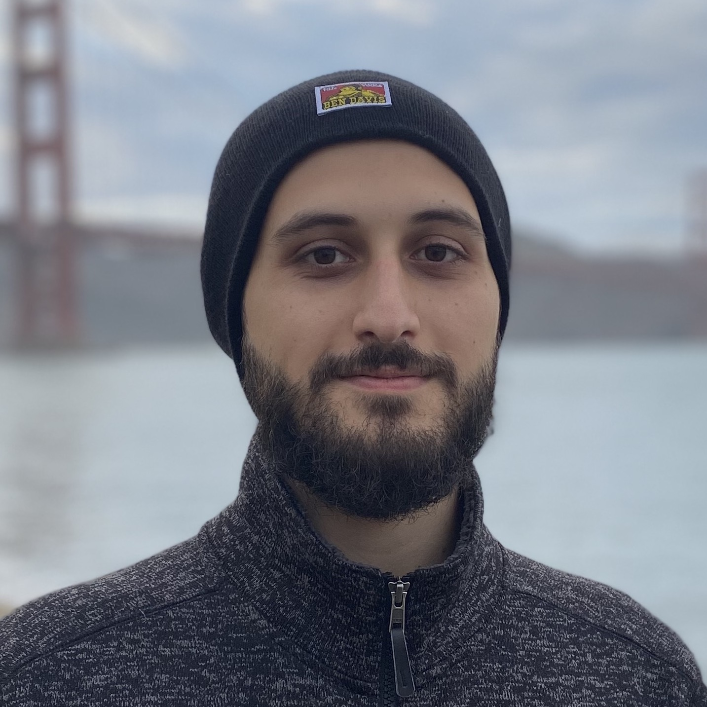

# Welcome to my page!
:robot:




## About me:
:bowtie: My name is Arman Mansourian. I am a Computer Science student at :ocean::trident:**University of California San Diego**:trident::ocean: with interests in machine learning applications, computer vision, and health. I am also a voluneer for *The Brain Institute* at **Chapman University** as a research programmer writing experiments using :eye:EyeLink:eye: eye trackers.

> Currently open for Software Engineering roles starting Summer or Fall 2021.

And obviously,
```
>>> print('I love to code :)')
I love to code :)
```

## Contact:
`mansourianarman@gmail.com` or `armansou@ucsd.edu`

## Links:
- [LinkedIn Profile](https://www.linkedin.com/in/arman-mansourian/)
- [GitHub Profile](https://github.com/amansourian)

## Goals for 2021:
- [ ] Contribute more to open-source projects :technologist:
- [ ] Get the fancy undergraduate degree :student:
- [ ] Run 365 miles :grimacing:
